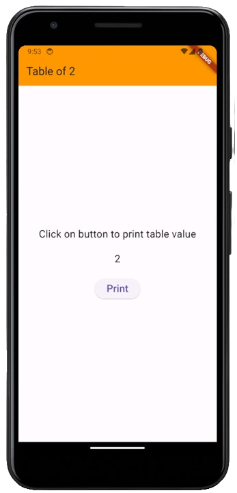
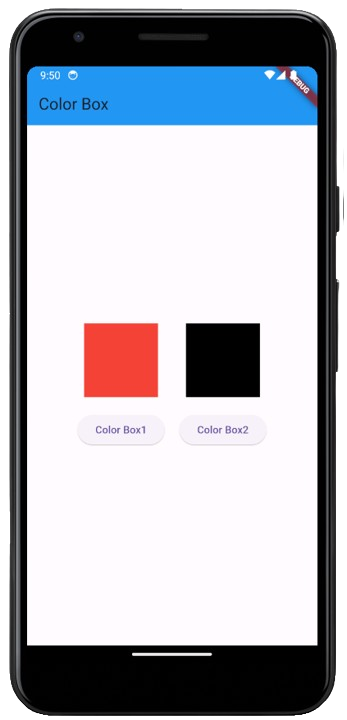
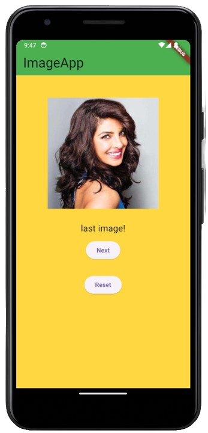

# Assignment 1
### This is the stateful widget assignment to print the table of 2.

## Preview

# Assignment 2
### This is the stateful widget assignment to show 2 containers, and on click the color should be toggle.

## Preview

# Assignment 3
### This is the stateful widget assignment to show the images and on next button next image should be visible on screen and on reset button, first image should be visible.

## Preview
